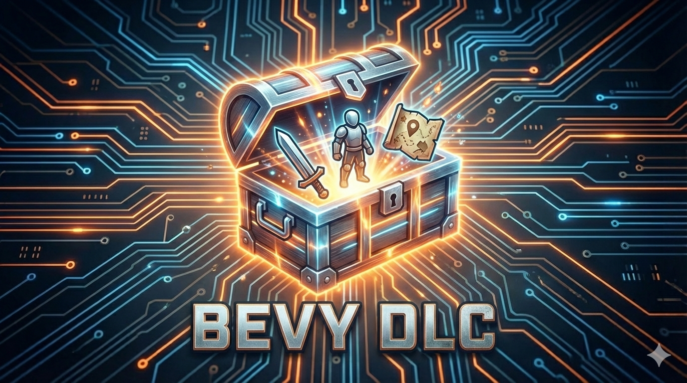

<p align="center">
  
</p>

---

[](https://crates.io/crates/bevy-dlc)
[](https://docs.rs/bevy-dlc)
[](https://opensource.org/licenses/MIT)

Encrypt and ship your DLC!  Create your DLC logic and assets and securely unlock it at runtime with signed licenses (generated using `bevy-dlc` CLI).

Works with Bevy's asset pipeline.

## Features

- Pack assets into encrypted `.dlcpack` containers
- Sign licenses with Ed25519 (private key embeds the symmetric encryption key)
- Verify signatures at runtime and unlock encrypted content
- Lazy loading of labeled assets (e.g. `pack.dlcpack#sprites/player.png`)
- Product binding — prevent token reuse across games

## Install

Add to your `Cargo.toml`:

```toml
bevy-dlc = "1.2"
```

To use the CLI tool:

```bash
cargo install bevy-dlc
```

Then `bevy-dlc --help` for available commands.

## Quick Start

### Generate a license

```bash
bevy-dlc generate -o keys/ my-game expansion_1
```

This will generate two files in `keys/`:
- `expansion_1.slicense` — a secure license token that can be safely embedded in your game binary (e.g. with `secure::include_secure_str_aes!()`) or stored securely on disk.  This token contains the encrypted symmetric key needed to unlock the DLC, but can't be decrypted without the private key.
- `expansion_1.pubkey` — the public key that your game uses to verify the license and extract the symmetric key to unlock the DLC.

### Create a pack

```bash
bevy-dlc pack --product my-game expansionA -o dlc -- assets/expansionA
```

- `--product` — binds the pack to a product name
- `assets/expansionA` — directory or file(s) to pack
- `expansionA` — DLC ID (used in licenses to unlock this pack)
- `-o dlc` — output path for the generated `.dlcpack`
- `--types` — optional list of asset type paths to include in the pack index (e.g. `bevy::prelude::Image`), otherwise all assets will be indexed with their full type paths.  This can be used to normalize type paths across different versions of Bevy or your game.  The types you specify are fuzzy matched against the actual asset types in the pack, so you can just specify `assets::MyAsset` and it will match `my_game::assets::MyAsset` in the pack if that's the actual type.

This creates `expansionA.dlcpack` and prints a signed license token.

Alternatively you can use `bevy-dlc generate --help` to review how to generate a signed license without packing, or `bevy-dlc validate --help` to verify it.

> [!NOTE]
> `bevy-dlc help <command>` for detailed usage of each CLI command.

### Edit a pack
You can edit the contents of a `.dlcpack` with `bevy-dlc edit`:

```bash
bevy-dlc edit <my_dlc>.dlcpack
```
This opens an interactive REPL where you can add/remove files, and list contents.  Changes are saved back to the `.dlcpack` when you `save` and if you forget and exit, REPL will ask you.

### Load in your app

> [!NOTE]
> As of `v1.2`, the `DlcPlugin` constructor no longer takes a `Product` argument.  Product binding is now handled at the pack and signed license level.  

```rust
// <aes-key> can be generated using `bevy-dlc generate --aes-key` or any secure random 32-byte key.
secure::include_secure_str_aes!("example.slicense", "<aes-key>", "example_license");

let dlc_key = DlcKey::public(include_str!("../../example.pubkey")).expect("invalid example pubkey");
let signedlicense = SignedLicense::from(get_example_license());

App::new()
    .add_plugins(DefaultPlugins)
    .add_plugins(DlcPlugin::new(
        dlc_key,
        signedlicense,
    ))
    .init_asset::<TextAsset>()
    .register_dlc_type::<TextAsset>()
    .add_systems(Startup, startup)
    .add_systems(
        Update,
        show_dlc_content.run_if(is_dlc_loaded("expansionA")),
    )
    .run()
```

### Load assets

Once unlocked, load assets from your pack like normal:

```rust
let pack: Handle<DlcPack> = asset_server.load("expansion_1.dlcpack");
let image: Handle<Image> = asset_server.load("expansion_1.dlcpack#sprites/player.png");
```

*Review the [examples](examples/) for a complete example (run with `cargo run --example <example>`).*

### Suggestions and Contributions

Contributions are very welcome!  Please open an issue or submit a pull request with any improvements, bug fixes, or new features.

## License

MIT


